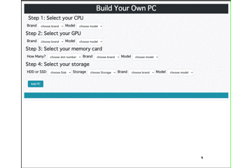

# Computer Builder
from コンピュータサイエンスが学習できるアメリカ発のサービス　[Recursion](https://recursionist.io/)

## Description
CPU, GPU, RAM, Storageを選択し、画面に選択したスペックのPCを出力する。

1. APIを使用して非同期処理でデータを取得。
2. PCのSPECを各項目選択。
3. ADD Buttonを押し、画面下部に出力。

- JSONの扱い
- Promise objectの扱い
- Lambda関数の使用
- HashMapを使用し重複の削除
- MVCモデルに沿った設計

※見た目はbootstrapでざっくり作成。index.jsをメインにしている。

## URL
[Computer Builder](https://soysan.github.io/Computer-Builder/) 

## Demo

## Requirement
Bootstrap4.5の使えるブラウザ

## Author
[@soylove2](https://twitter.com/soylove2)
